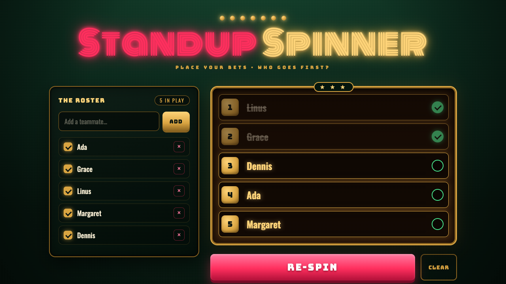

# 🎰 Standup Spinner

A single-page slot machine that picks your team's standup running order. Add your team, pull the lever, then check people off as they present.

**[→ Try it live](https://statico.github.io/standup-spinner/)**

## Features

- Add, enable/disable, or remove team members
- A slot-machine spin draws a random running order
- Check people off as they go, with a progress bar to the finish
- A random over-the-top celebration (coins, fireworks, confetti…) when the last person wraps up
- Everything persists in your browser via `localStorage`

No build step, no dependencies — it's one `index.html`. Open it locally or host it anywhere static.
